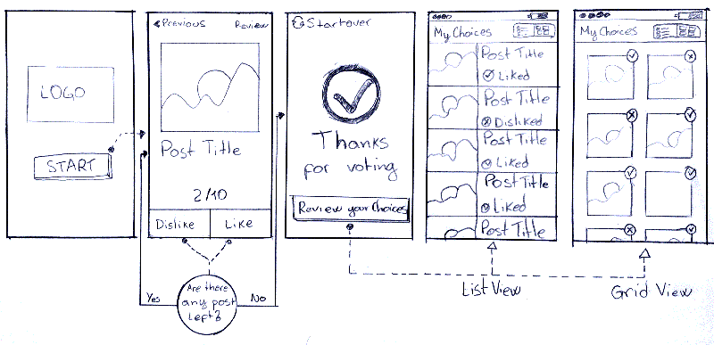

# Erick's test app to Home24!

This is an test app for the **Home24's iOS Developer Job.**


### Screenshots
See how does it work


## Changing the number of post to show
In the file `Constants.swift` change the constant `NUM_OF_POSTS` to any value you want at line 12
```swift
	static let NUM_OF_POSTS = 10
```

## Library Dependencies

This app has some dependencies and uses [CocoaPods](https://github.com/CocoaPods/CocoaPods) as  dependency manager.
Checkout a complete list of the dependent libraries below:

| Link | Description |
| :----- | :------ |
[CocoaPods.org](https://cocoapods.org/) | Homepage and search for Pods.
[Alamofire](https://github.com/Alamofire/Alamofire) | Alamofire is an HTTP networking library.
[AlamofireObjectMapper](https://github.com/tristanhimmelman/AlamofireObjectMapper) | An extension to [Alamofire](https://github.com/Alamofire/Alamofire) which automatically converts JSON response data into swift objects using [ObjectMapper](https://github.com/Hearst-DD/ObjectMapper/).
[ObjectMapper](https://github.com/Hearst-DD/ObjectMapper/) | ObjectMapper is a framework written in Swift that makes it easy for you to convert your model objects (classes and structs) to and from JSON.
[AFNetworking](https://github.com/AFNetworking/AFNetworking) | AFNetworking is a delightful networking library for iOS, macOS, watchOS, and tvOS.
[Kingfisher](https://github.com/onevcat/Kingfisher) | Kingfisher is a lightweight, pure-Swift library for downloading and caching images from the web.

### Scratch



